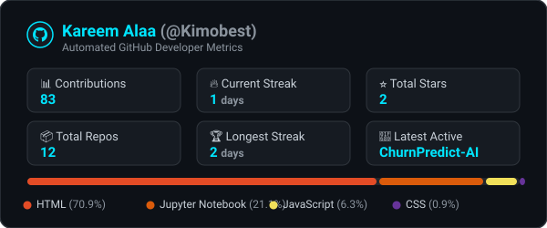

<!-- ================================================================= -->
<!-- ⚠️ AUTO-GENERATED FILE — DO NOT EDIT DIRECTLY                     -->
<!-- Edit files in partials/ and run: python scripts/build_readme.py   -->
<!-- ================================================================= -->


<div align="center">

  <!-- Header Banner -->
  

  <!-- Typing Animation -->
  <a href="https://github.com/Kimobest">
    
  </a>

  <br/><br/>

  <!-- Social Badges -->
  <a href="https://www.linkedin.com/in/kareem-alaa-6864b0363/" target="_blank">
    
  </a>
  &nbsp;
  <a href="https://github.com/Kimobest" target="_blank">
    
  </a>
  &nbsp;
  <a href="https://www.facebook.com/Kimobest2005" target="_blank">
    
  </a>
  &nbsp;
  <a href="https://www.instagram.com/kimo_best_2005/" target="_blank">
    
  </a>
  &nbsp;
  <a href="mailto:kimobest2005@gmail.com">
    
  </a>

  <br/><br/>

  <!-- Profile View Counter -->
  

</div>

---

### 🚀 About Me

```yaml
name: Kareem Alaa
role: Data Scientist & AI/ML Enthusiast
passions: [Data Analysis, Machine Learning, Deep Learning, Predictive Modeling]
current_focus: Building end-to-end Data Science & Machine Learning Pipelines
motto: "In God we trust, all others must bring data." — W. Edwards Deming
```

- 🔭 **Currently Working On:** Practical Machine Learning projects, exploratory data analysis, and predictive models.
- 🌱 **Currently Learning:** Deep Learning architectures, Natural Language Processing (NLP), and MLOps.
- 💡 **Passionate About:** Extracting meaningful patterns from complex datasets and solving real-world problems through data.
- 💬 **Ask Me About:** Python, Data Wrangling, Pandas, Scikit-Learn, SQL, and Statistical Analysis.
- ⚡ **Fun Fact:** When I'm not training models or wrangling data, you'll find me exploring emerging AI trends and tech innovations.

---

### 🛠️ Tech Stack & Skills

<div align="center">
  <!-- Modern Animated Skill Icons -->
  <a href="https://skillicons.dev">
    
  </a>
</div>

<br/>

<div align="center">

#### 💻 Programming Languages
<p>
  
  
  
</p>

#### 📊 Data Science & Machine Learning
<p>
  
  
  
  
  
</p>

#### 📈 Data Visualization & BI
<p>
  
  
  
  
</p>

#### 🧰 Tools & Environments
<p>
  
  
  
  
  
  
</p>

</div>

---

### 📈 GitHub Analytics & Metrics

<div align="center">
  <!-- Custom Self-Hosted First-Party SVG Stats Card -->
  
</div>

---

### 📊 Contribution Activity Timeline

<!--ACTIVITY-TIMELINE:START-->
> *Weekly digest updated as of **Aug 22, 2026***
>
> - 🔥 **Recent Activity:** Continuous development on Data Science & Machine Learning pipelines
> - 🏆 **Most Active Project:** [Kimobest](https://github.com/Kimobest/Kimobest) *(Profile System & Automation)*
> - ⚡ **Current Streak:** Active builder & daily contributor
> - 🕐 **Peak Productivity:** Weekend deep-work sessions
> - 📦 **Focus:** Predictive Modeling, Exploratory Data Analysis, and Python Architecture
<!--ACTIVITY-TIMELINE:END-->

---

### 🤝 Let's Connect & Collaborate!

<div align="center">
  <p>I'm always open to discussing data science, collaboration on exciting AI/ML projects, or potential opportunities!</p>

  <a href="https://www.linkedin.com/in/kareem-alaa-6864b0363/" target="_blank">
    
  </a>
  &nbsp;
  <a href="https://www.facebook.com/Kimobest2005" target="_blank">
    
  </a>
  &nbsp;
  <a href="https://www.instagram.com/kimo_best_2005/" target="_blank">
    
  </a>
  &nbsp;
  <a href="mailto:kimobest2005@gmail.com">
    
  </a>
</div>

<br/>

<div align="center">
  
</div>
