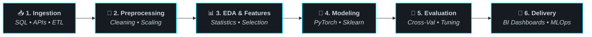

---

### 🚀 About Me & Machine Learning Workflow

<div align="center">

  <!-- Quick Status Badges -->
  <p align="center">
    
    
    
  </p>

</div>

```python
from dataclasses import dataclass
from typing import List

@dataclass
class KareemAlaa:
    name: str = "Kareem Alaa"
    role: str = "Data Scientist | AI & Machine Learning Practitioner"
    focus_areas: List[str] = ("Predictive Modeling", "Deep Learning", "Data Mining", "MLOps")
    core_stack: List[str] = ("Python", "PyTorch", "Scikit-Learn", "SQL", "Pandas", "Power BI")
    philosophy: str = "In God we trust, all others must bring data."

    def build_solution(self, raw_data) -> "ProductionMLPipeline":
        intelligence = self.extract_intelligence(raw_data)
        model = self.train_and_validate(intelligence, target_metric="High Precision & Recall")
        return model.deploy(monitoring=True)
```

#### 🔄 End-to-End Data Science & Machine Learning Lifecycle



<br/>

| Stage | Focus, Methodologies & Output | Primary Tooling |
| :--- | :--- | :--- |
| **📥 Data Acquisition & Ingestion** | Querying relational data, integrating REST APIs, and structuring raw inputs into reproducible pipelines. | `SQL`, `PostgreSQL`, `MySQL` |
| **🧹 Data Wrangling & Cleaning** | Missing data imputation, outlier detection, data normalization, categorical encoding, and integrity checks. | `Pandas`, `NumPy`, `Regex` |
| **📊 EDA & Feature Engineering** | Uncovering distribution patterns, correlation heatmaps, statistical hypothesis testing, and PCA dimensionality reduction. | `SciPy`, `Matplotlib`, `Seaborn` |
| **🧠 Model Development & Training** | Constructing predictive algorithms, deep neural nets, gradient boosting models, and cross-validation pipelines. | `Scikit-Learn`, `PyTorch`, `TensorFlow` |
| **🎯 Evaluation & Optimization** | Hyperparameter tuning (GridSearch/Optuna), confusion matrix analysis, ROC-AUC curve benchmarking, and bias-variance balancing. | `Scikit-Learn`, `SciPy` |
| **📈 Actionable BI & Visualization** | Designing executive KPI dashboards, interactive charts, and business intelligence reports. | `Power BI`, `Tableau`, `Plotly` |
| **⚙️ Reproducibility & Environments** | Version control, containerized experimentation, virtual environments, and continuous code maintenance. | `Git`, `GitHub Actions`, `VS Code`, `Conda` |

<br/>

> [!TIP]
> 💡 *"In God we trust, all others must bring data."* — **W. Edwards Deming**
